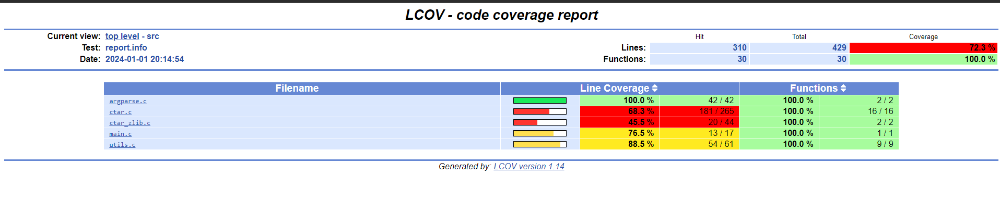

# Rapport ctar

Le rapport ci-présent donne un aperçu sur le travail qui a été mené pour l’implémentation d’un générateur/extracteur d’archive `.tar`, similaire à la commande éponyme `tar`, par **Samy Mosa** et **Younes Bokhari**.

## Sommaire

- [Choix de conception](#choix-de-conception)
- [Difficultés rencontrées](#difficultés-rencontrées)
- [Organisation de travail](#organisation-de-travail)

## Choix de conception

### Structure du projet

Le projet est composé de plusieurs dossiers :
- **/bin** : contient le binaire `ctar` généré par la commande `make`.
- **/docs** : contient les fichiers `doxygen` pour la documentation de code.
- **/include** : contient les entêtes des fichiers du programme.
- **/src** : contient les fichiers du programme :
  - **argparse.c** : gère le parsing des arguments.
  - **ctar.c** : regroupe les principales fonctionnalités du programme : génération d'archive, extraction, listage des éléments...
  - **ctar_zlib.c** : gère la compression et décompression d'une archive.
  - **main.c** : point d'entrée du programme.
  - **utils.c** : fonctions utilitaires du programme.

### ctar_header

Dans le cadre du parcours d’une archive, il a été nécessaire de lire de façon répétée les entêtes correspondant au format étudié, [Basic Tar Format](https://www.gnu.org/software/tar/manual/html_node/Standard.html), pour chaque item composant l'archive. De ce fait, une structure `ctar_header` a été définie, composée de différentes propriétés de type `char[]` facilitant les opérations, notamment le calcul de `chksum` :

```c
typedef struct ctar_header
{
  char name[CTAR_NAME_SIZE];
  char mode[CTAR_MODE_SIZE];
  char uid[CTAR_UID_SIZE];
  char gid[CTAR_GID_SIZE];
  char size[CTAR_SIZE_SIZE];
  char mtime[CTAR_MTIME_SIZE];
  char chksum[CTAR_CHKSUM_SIZE];
  char typeflag[CTAR_TYPEFLAG_SIZE];
  char linkname[CTAR_LINKNAME_SIZE];
  char magic[CTAR_MAGIC_SIZE];
  char version[CTAR_VERSION_SIZE];
  char uname[CTAR_UNAME_SIZE];
  char gname[CTAR_GNAME_SIZE];
  char devmajor[CTAR_DEVMAJOR_SIZE];
  char devminor[CTAR_DEVMINOR_SIZE];
  char prefix[CTAR_PREFIX_SIZE];
  char pad[CTAR_PAD_SIZE];
} ctar_header;
```

### Interface en mode console "tui"

Nous avons volontairement écarté l'exigence **FMO03 – La réalisation d’une interface en mode console « tui » via la librairie ncurses** pour optimiser notre temps et nous concentrer sur l'essentiel. Cette décision nous a permis de mieux allouer nos ressources aux éléments clés du projet, assurant une meilleure qualité et le respect des délais, reflétant ainsi notre aptitude à prioriser stratégiquement.

## Difficultés rencontrées

### Hétérogénéité de niveaux

Dans notre projet, nous avons rencontré une hétérogénéité de niveaux avec d'une part Samy, ayant une bonne maîtrise du langage C, et d'autre part Younes, ayant un niveau intermédiaire. Pour pallier cette hétérogénéité et favoriser un environnement d'apprentissage mutuel, nous avons adopté une approche structurée et collaborative :
- Des sessions de **pair programming** régulières, permettant à Younes d'acquérir des compétences pratiques en observant et en travaillant directement avec Samy.
- Des **points réguliers** pour évaluer l'avancement du projet et identifier les zones de progression pour Younes.
- Des **code reviews** pour discuter des choix de programmation et renforcer la compréhension du code de chacun.

Cette stratégie a permis non seulement de maintenir la qualité et la cohérence du projet, mais aussi de progresser mutuellement d'un point de vue technique.

### Documentation zlib.h

Une autre difficulté rencontrée a été la documentation de la bibliothèque ***zlib***, regroupée dans le fichier dense ***zlib.h*** de plus de 1900 lignes. Au départ, nous avons opté pour une approche personnalisée en compression et décompression, en utilisant un [script open-source](https://gist.github.com/arq5x/5315739). Cependant, cette méthode s'est avérée plus complexe que l'utilisation des fonctions natives de zlib, comme `gzopen()` et `gzwrite()`, qui offrent une meilleure robustesse. La solution a donc été réimplementée en conséquence. Toutefois, cette expérience a été bénéfique pour Younes, en charge de cette tâche, lui permettant de se familiariser davantage avec le langage C et ses concepts clés.

<div class="page"></div>

## Organisation de travail

### Gitflow

Nous avons adopté une stratégie de versionning efficace grâce à l'approche **Gitflow** sur GitHub, distinguant le développement de nouvelles fonctionnalités (branches `features`) et la correction de bugs (branches `fix`), avec `main` comme branche principale. Cette méthode a assuré une organisation claire et une bonne traçabilité. Les **code reviews**, utilisées pour les modifications majeures, ont maintenu la qualité du code sans surcharger le processus de développement. Parallèlement, l'intégration de **CI/CD** via GitHub Actions a automatisé la compilation et les tests du code C, de même que la génération et la publication de la documentation, améliorant la qualité, facilitant le débogage et accélérant l'amélioration continue.

### Répartition des tâches

Au sein de notre binôme, la répartition des tâches a été planifiée pour exploiter au mieux nos compétences respectives et assurer une progression équilibrée du projet. Samy s'est concentré sur les aspects relatifs à la lecture, l'extraction et la création d'archives pour un total de **12 heures** de travail. De son côté, Younes a travaillé sur l'implémentation de l'option directory `-d`, la compression et décompression, et la rédaction du rapport ci-présent pour un total de **11 heures** de travail.

### Tests

Nous avons privilégié des tests fonctionnels à des tests unitaires pour leur simplicité et rapidité d'exécution, et utilisé `gcov` pour évaluer la couverture de code, atteignant des scores satisfaisants de **100%** pour les fonctions et **72.5%** pour les lignes. Concernant les lignes, la couverture n'a pas atteint 100% principalement en raison des segments de code dédiés aux mécanismes de gestion d'erreur, qui étaient moins fréquemment exécutés.



## Conclusion

En conclusion, notre projet, visant à simplifier l'implémentation d'un générateur et extracteur d'archives `.tar`, nous a immergés dans la gestion de fichiers et la compression de données. Grâce à une répartition équilibrée des tâches et une collaboration structurée, nous avons surmonté des défis techniques, avec un accent sur la bibliothèque ***zlib*** et la manipulation de fichiers. Le **pair programming** et les **code reviews** ont assuré une qualité de code constante, tandis que l'intégration de **CI/CD** via GitHub Actions a augmenté notre efficacité de développement. Ce projet a non seulement atteint ses objectifs, mais a également enrichi nos compétences en programmation C, gestion de projet et travail d'équipe, offrant de bonnes leçons pour nos futurs projets.